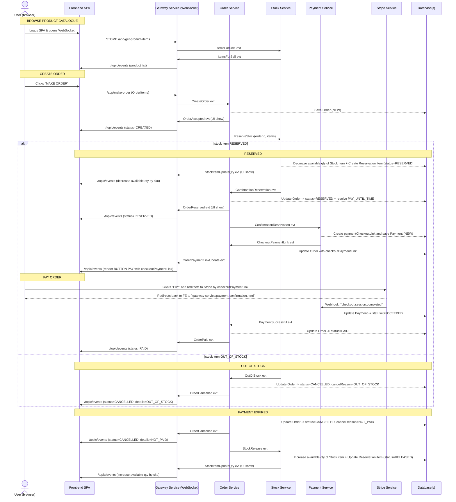

# Shop Platform

This repository contains the microservice‑based e‑commerce demo **Shop Platform**.  
The diagram below illustrates the full happy‑path plus out‑of‑stock branch for a shopper moving from browsing products through paying with Stripe.

## Sequence diagram – end‑to‑end checkout flow

