# Shop Platform 🛍️

---

## 👋 Intro

An **event‑driven, microservice e‑commerce demo** built with **Spring Boot 3 + Kafka + PostgreSQL**.

> The **main goal**  of the application is to enable users to **SELECT → RESERVE → PAY** for desired items.

This project is intended as **a code showroom** to demonstrate core coding and architecture skills;\
_**it is not a production-ready system**_.

<br>

## 🚀 Live Demo

👉 **Try it now:** [shop-platform - demo](http://185.167.96.143:8080)

> _**Note:** Use Stripe test card **4242 4242 4242 4242** with **12/34** and CVC **567**_

<br>

## 🗺️ Table of Contents

- [Quick Start](#-quick-start---just-run-services)
- [Technical stack](#-technical-stack)
- [Features](#-features)
- [Services break-down](#-services-break-down)
- [Local development](#-local-development) 
- [Architecture](#-architecture)
- [Next Steps & Known Gaps](#-next-steps--known-gaps)

<br>

## 🚀 Quick Start - Just run services

### Prerequisites

- Java 17 JDK
- Docker & Docker Compose
- Git

### 1) Get the repo

```bash
# Clone the repo
git clone https://github.com/developer-stepanov/shop-platform.git
cd shop-platform
```

### 2a)  Run with Prebuilt Images Only

```bash
# Automatically pull and run services
docker compose up -d --pull missing --no-build
```

### 2b) Build images locally and run them

```bash
# Build and run services
docker compose up -d --build
```

> _**Go:**_ 🎯 **Gateway Service** → `http://localhost:8080`

<br>

## 🧱 Technical stack

* **Java 17** / **Spring Boot 3.4.5**
* **WebSockets**
* **Apache Kafka 3** (KRaft mode)
* **PostgreSQL 16**
* **Gradle 8**
* **Docker Compose v2** & **Docker Buildx** (see `docker-bake.hcl`)
* **Stripe Java SDK**
* **Groovy / Spock framework for testing**

<br>

## ✨ Features

- **Microservices architecture** - Clearly separated responsibilities for better scalability and maintainability.
- **Real‑time UI updates** - WebSocket events published by the **gateway-service**.
- **Secure payments (Stripe Checkout)** – Out-of-the-box card and wallet support via Stripe’s hosted checkout flow; PCI burden stays with Stripe.
- **Event-driven messaging (Kafka)** - Asynchronous communication between services through Apache Kafka topics for loose coupling and resilience.
- **Container-native deployment** - One-command start-up with Docker Compose for quick and efficient development and testing.
- **Version-controlled database migrations (Liquibase)** - For schema migration and version control.
- **Behaviour-driven testing (Spock)** - Groovy/Spock test suites describe behaviour in a human-readable, Given-When-Then style.

<br>

## 🛠 Services break-down

| Service                                     | Responsibility                                           | Port            | Database     | Image tag                               |
|---------------------------------------------|----------------------------------------------------------| --------------- |--------------|-----------------------------------------|
| **[gateway-service](./gateway-service/)**   | WebSocket gateway; translates UI commands to events      | `8080`          | none         | `shop-platform:gateway-service-latest`  |
| **[order-service](./order-service/)**       | Order lifecycle, handles reservation + payment timeouts  | `8081`          | `order-db`   | `shop-platform:order-service-latest`    |
| **[stock-service](./stock-service/)**       | Stock quantities and reservation handling                | `8082`          | `stock-db`   | `shop-platform:stock-service-latest`    |
| **[payment-service](./payment-service/)**   | Stripe integration & payment webhooks                    | `8083`          | `payment-db` | `shop-platform:payment-service-latest`  |
| **[library](./library/)**                   | Shared Kafka events, utility code                        | N/A             | N/A          | Gradle library                          |
| **[infra (docker-compose)](./infra/dev/)**  | Kafka single‑node cluster in Kraft mode, Postgres Trio   | `9092`, `29092` | N/A          | `bitnami/kafka:4.0`                     |

<br>

## 💻 Local development

### Prerequisites

- Java 17 JDK
- Docker & Docker Compose
- Git

```bash
# 0. Clone the repo
git clone https://github.com/your-username/shop-platform.git
cd shop-platform

# 1. Start Kafka and Postgres Trio
docker compose -f infra/dev/docker-compose.yml up -d --build

# 2. Build all services
./gradlew clean build
```

```bash
# 3. Launch gateway service
./gradlew :gateway-service:bootRun --args='--spring.profiles.active=dev'
```

```bash
# 4. Launch order service
./gradlew :order-service:bootRun --args='--spring.profiles.active=dev'
```

```bash
# 5. Launch stock service
./gradlew :stock-service:bootRun --args='--spring.profiles.active=dev'
```

```bash
# 6. Launch payment service
./gradlew :payment-service:bootRun --args='--spring.profiles.active=dev'
```

> _**Go:**_ 🎯 **Gateway Service** → `http://localhost:8080`

### Stripe webhook connection to local environment

```bash
# 7. Wire up Stripe webhooks

# Log in (opens a browser tab)
stripe login

# Forward every event to the payment-service
stripe listen --forward-to localhost:8083/stripe/webhook
```

#### Explore and code!

<br>

## 🧩 Architecture

### High‑level overview

---

The Shop Platform is built as an **event-driven microservices** ecosystem. All inter-service communication happens asynchronously over **Apache Kafka** topics; services react to domain events rather than blocking synchronous calls. Users interact via a **WebSocket-powered gateway**, which translates UI commands into Kafka commands and fans out state updates to the browser **in real time**.


> _**Note:**_ For clarity, the Kafka event bus is not shown; **all arrows represent _asynchronous event messages_ on Kafka topics**.

```mermaid
flowchart LR
    subgraph Backend
        GW[Gateway<br/>8080]
        OS[Order<br/>8081]
        SS[Stock<br/>8082]
        PS[Payment<br/>8083]
        ST[Stripe<br>3rd]
    end
    FE[Front-End: user] -->|🛍️ SELECT+RESERVE: WebSocket| GW
    GW <--> OS
    GW <--> SS
    OS <--> SS
    OS <--> PS
    ST --> |webhook| PS
    FE[Front-End: user] --> |💸 PAY: CheckoutURL| ST
    classDef svc fill:#fff4dd,stroke:#ffa500,stroke-width:1;
    class GW,OS,SS,PS,ST svc
```



### 🛍️ Order-to-Payment Workflow

---

#### 1️⃣ Step: SELECT desired items -> MAKE ORDER


#### 2️⃣ Step: PAY for desired items -> PAY button and go to STRIPE checkout URL


#### 3️⃣ Step: PAYMENT CARD info


#### 💳 Stripe test card 

| Field             | Value                 |
|-------------------|-----------------------|
| **Card Number**   | `4242 4242 4242 4242` |
| **Expiry Date**   | `12/34`               |
| **CVC**           | `567`                 |
| **Name**          | `Test Test`           |

### Detailed diagram checkout flow

---


> This sequence diagram shows how our event-driven checkout saga plays out from end to end. When the user clicks **MAKE ORDER** in the UI, the gateway publishes a `CreateOrder` event, which the Order Service immediately persists, then fires off a `ReserveStock` command to the Stock Service. If inventory is available, Stock sends back a reservation confirmation, the Order Service marks the order **RESERVED**, computes a payment deadline, and asks the Payment Service to build a Stripe checkout link. This link sends back to the Order service. By clicking PAY button in the UI the user is then redirected to Stripe’s hosted checkout - to complete the payment. Once Stripe calls our webhook with `checkout.session.completed`, the Payment Service emits `PaymentSuccessful`, the Order Service transitions to **PAID**, and the gateway pushes the final `OrderPaid` event to the browser.

> If stock isn’t available, the Stock Service immediately raises an `OutOfStock` event and we cancel the order. Likewise, if the user never pays before the **TTL (Time To Live)** expires, a background scheduler in the Order Service automatically cancels the reservation and publishes a `StockRelease` event to restore inventory. By orchestrating everything through Kafka topics and idempotent consumers, we achieve loose coupling, clear separation of concerns, and eventual consistency across microservices.

<br>

## 🚧 Next Steps & Known Gaps

While this demo covers the core **SELECT → RESERVE → PAY** flow, here are a few things to sort out before calling this production-ready:

- **Authentication & Authorization**  
  No user login, session management or role-based access control. All actions are anonymous.

- **API Documentation (OpenAPI/Swagger)**  
  No Swagger UI.

- **Observability & Monitoring**  
  No metrics (Prometheus), tracing (OpenTelemetry/Brave), or centralized logging (Grafana) is configured.

- **Resilience Patterns**  
  No any circuit breakers, retry/backoff logic, or dead-letter queues - so if a downstream service hiccups, the flow can just hang or fail silently.

- **Saga Coordination & Idempotency**  
  Platform based on pure choreography, so there’s no central saga tracker or idempotency keys on our commands and webhooks.

- **Refunds & Partial Cancellations**  
  No flow for issuing refunds, handling disputes, or partially cancelling orders.

- **Secrets & Configuration Management**  
  Stripe API keys and service URLs are just sitting in `application.yml` or env vars in plain text - there’s no Vault or Kubernetes Secrets setup to keep them safe.

- **CI/CD Pipeline**  
  Haven’t set up any automated CI/CD, load/performance testing, or coverage reporting yet.

- **Clustered Deployment & High Availability**  
  Kafka and Postgres just running as a single-node trio in Docker Compose - no Kubernetes setup or HA configuration.

- **Schema Evolution & Registry**  
  Not using a schema registry for our Kafka messages, so keeping track of versions can get messy.

- **Documentation & Diagrams**  
  Only have those Mermaid snippets in the README - there’s no standalone architecture guide, separate sequence diagram docs, or any ADRs.

Addressing these gaps would take this demo from **"showroom"** to a more robust, production-ready platform.

🏁 **Enjoy exploring the Shop Platform!**